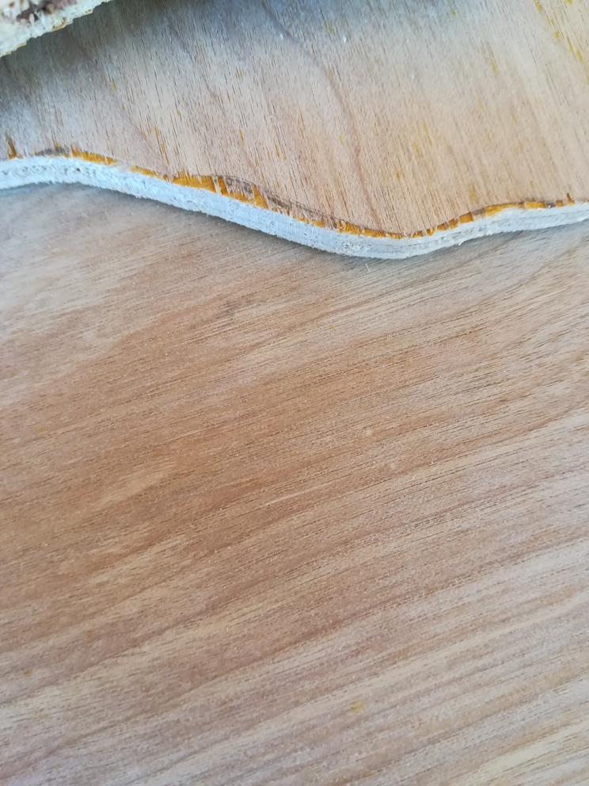
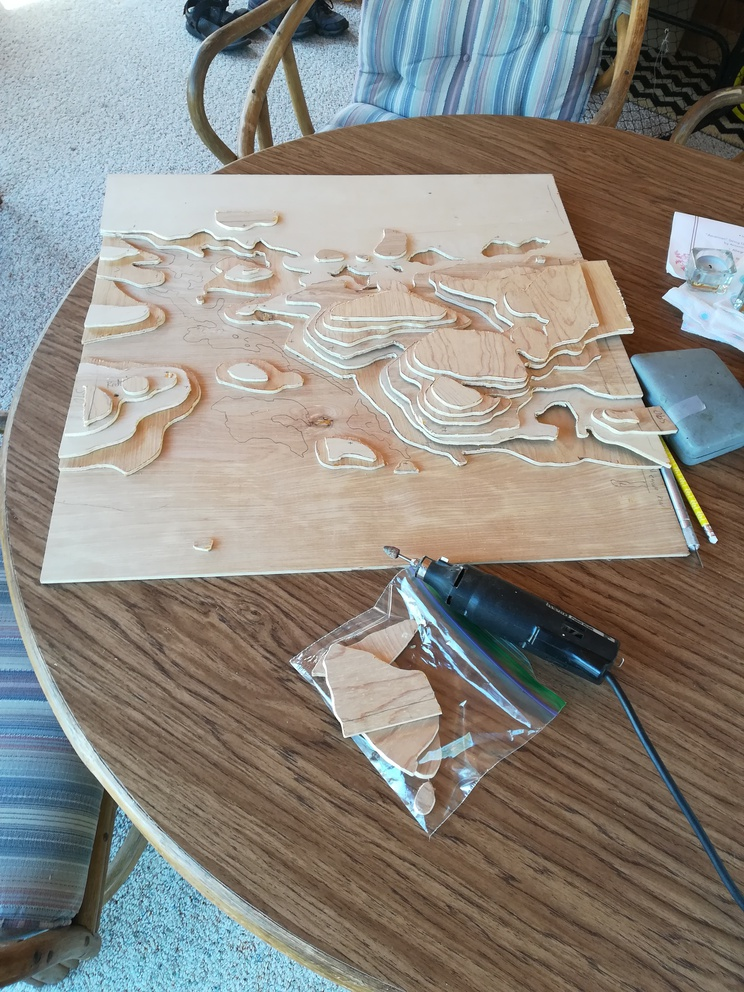

```{r setup, include=FALSE}
library(rgdal)
library(raster)
library(dplyr)
library(rgeos)
```


## About

At 2,301 feet, Eagle Mountain is the highest point in the state of Minnesota. While it lacks prolific elevation, Eagle Mountain has 437 miles of isolation from the nearest higher point, which ranks it 10th among the most isolated peaks in the United States and its territories.

I've had the pleasure of hiking Eagle Mountain twice, and both times I was struck by the beauty of the terrain. The peak, in Superior National Forest, offers a cliff overlook (a feature only found in the northeast of the state) with views of a spattering of lakes (which charactertizes all of Minnesota). Physical topographic mapping provides the perfect opportunity to practice technical and artistic skills; given its status, Eagle Mountain makes the perfectsubject.

### Materials

To build a wooden map, I used the following materials:

* 1/8 inch wood panelling
* wood glue
* blue watercolor paints

Tools:

* projector
* pencil
* razor
* jigsaw
* dremel tool with coarse sanding bit
* paint brush
* clamps
* table saw (optional)

And data:

* geographic features from OpenStreetMap (in osm format)
* elevation data from NASA SRTM (in hgt / raster format)

## Procedure

### Computing map data

Trail and lake data are taken from the [OpenStreetMap](https://openstreetmap.org) exporter UI in `osm` format:
```{r echo = TRUE, warning=FALSE}
extent <- list(xmin=-90.6043,
               xmax=-90.5383,
               ymin=47.8871,
               ymax=47.9180)
osm_path <- 'eagle_mountain_tile.osm'
em_lakes <- readOGR(osm_path, 'multipolygons')
em_lines <- readOGR(osm_path , 'lines')
em_trail <- em_lines[em_lines$name %in% c("Eagle Mountain Hiking Trail"), ] 
```

The elevation is sourced from [ViewFinderPanoramas](http://viewfinderpanoramas.org/Coverage%20map%20viewfinderpanoramas_org3.htm) and is simply read in as raster data:

```{r echo = TRUE, warning=FALSE}
em_elevation_raster <- raster('N47W091.hgt') %>%
  crop(unlist(extent))
```

Contours are computed using an undocumented algorithm in base R `contourLines`. I believe it is doing something akin to [Marching Squares](https://en.wikipedia.org/wiki/Marching_squares).
```{r}
em_contours <- rasterToContour(em_elevation_raster, nlevels=15)
```

For building physical contour layers, contour layers of each elevation must be plotted separately. To these ends, a plotting function which shows contours, lakes (at base elevation), and any trail intersections:

```{r}
plot_level <- function(elevation, contours, lakes, trail, plot_extent = extent, min_elevation='560') {
  relevant_contours <- contours[contours$level == elevation,]
  
  plot(relevant_contours,
       xlim=c(plot_extent$xmin, plot_extent$xmax),
       ylim=c(plot_extent$ymin, plot_extent$ymax),
       axes=TRUE,
       lwd=5,
       main=elevation)
  
  # TODO this is not geopgrahically accurate, since some lakes are at elevation
  # could derive the heights and include in contours... but there are clearly
  # some accuracy errors in contour line placement and lake position. so
  # probably best to artistically eyeball
  if (elevation == min_elevation) {
    plot(lakes, col = 'blue',
         xlim=c(plot_extent$xmin, plot_extent$xmax),
         ylim=c(plot_extent$ymin, plot_extent$ymax),
         add=TRUE)
    plot(trail,
         col = 'green',
         xlim=c(plot_extent$xmin, plot_extent$xmax),
         ylim=c(plot_extent$ymin, plot_extent$ymax),
         add=TRUE)
  }
  
  trail_intersections <- gIntersection(trail, relevant_contours)
  
  if (!is.null(trail_intersections)) {
    plot(trail_intersections, 
         col='red',
         lwd=5,
         add=TRUE)
  }
  
  axis(side = 1, lwd = 5)
  axis(side = 2, lwd = 5)
  box(lwd=5)
}
```

which can be visualized:
```{r}
for (ele in levels(em_contours$level)) {
  jpeg(paste0("static/contours/", ele, ".jpg"), width=1500, height=1500)
  plot_level(ele, em_contours, em_lakes, em_trail)
  dev.off()
}
```

```{r echo = FALSE}
# requires imagemagick
system("convert -loop 0 -delay 50 static/contours/*  static/elevation_contours.gif")
```


The choice of 15 contour layers (about 10 meters per layer) was eyeballed - I wanted a balance between amount of cutting required and level of detail. At 15, the contour image looked cool, to boot! The whole landscape is visualized:

```{r}
plot(em_contours)
plot(em_trail, add=TRUE, col='green')
plot(em_lakes, add=TRUE, col='blue')
```

### Buidling the map

#### Marking cuts

Using a [$50 projector](https://www.amazon.com/DR-J-Upgraded-4Inch-Projector-Display/dp/B07174LM85), contour lines were projected onto wood paneling affixed to the wall.


Then, contours & lakes were traced onto the paneling in pencil:


After an entire layer was complete, it's "above" and "below" elevation regions were marked with a +/-, to denote where to cut:


This process was repeated for each contour layer. I used a fixed 2'x2' section of the wall to keep sizing consistent and to match my desired final size.

#### Making cuts

The paneling material I used was difficult to work with. Even with fine toothed, high velocity saws, its veneer flaked off easily, revealing an ugly yellow adhesive. To prevent this, I made scores using a razor on the "above" side of all cuts. The first image below shows a board after being scored and cut, and how the flaking only occured up until the point of scoring.




I used a bottom shelf ($11!) jigsaw to make the coarse cuts. As long as the blade was kept at speed (preventing the board from grabbing, resonating, and cracking) and relief cuts were occassionally made, the process was smooth. 


For internal cuts, I drilled out starting points for the jigsaw.


Finally, I used a dremel tool with a coarse grained sanding bit to smooth out the rough edges and burrs. 



#### Assembly

Once all layers were cut out, I colored the lakes and glued boards together. Painting was mostly an adhoc process, identifying regions beneath a lake layer that needed to be colored. I used an oil based paint / crayon thing (a Swiss product called Caran d'Ache neocolor II) to mix and produce a water color.


With all lakes painted, I used wood glue and clamps (or a heavy dictionary) to press together the panels. The clamping was necessary due to some warping in the panels, which can be seen in dremel image above.


After clamping, some of the border edges were not aligned or square, due to projection, tracing, or clamping errors. I used a table saw to create perfectly square framing.


Finally, I printed off the text "EAGLE MTN, 2301 FT" in a thick font (phosphate), cut out the letters, and wood burned (using a pointed soldering iron) a name plaque.


## Final Product


There are several aspects I am critical of:

* Many points of flaking / discoloration: many cuts still resulted in some flaking, and some of the panels has non-uniformly colored spots, both of which add noise and distract the eye
* Some of the contours appear jagged: While it may be what the data shows, I think the map would be more aesthetic if the contours were smoother & had more gradual curvature on some locations.

And several aspects I am proud of:

* The concept in general is quite neat; the 3D contours pop and catch the eye.
* The lake colors are a beautiful blue green which contrasts well with the tan boards.
* The name plaque looks homemade and off-the-cuff, which sets the mood for the piece. i.e. the viewer won't expect the contours to be perfectly CNCed, which excuses some of my mistakes!

If you're looking for a computer-assisted art project, I highly recommend trying this out on one of your favorite landmarks or landscapes!
