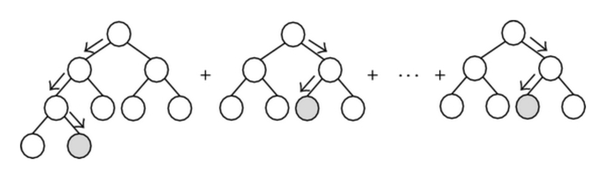

```{r setup, include=FALSE}
knitr::opts_chunk$set(echo = TRUE)
library(formula.tools)
library(MASS)
library(xgboost)
library(randomForest)
library(rpart)
library(rpart.plot)

rmse <- function(x,y){
  sqrt(mean((x - y)^2))
}
```

## About
This document is an overview of tree learning & commonly associated ensemble methods.

If building this document from source, install following R packages:
```r{eval=FALSE}
install.packages(c('MASS', 'xgboost', 'rpart', 'randomForest','formula.tools'))
```

### The data
The `iris` dataset will be used throughout this document. It was chosen due to its small size & strong correlations. Prediction tasks will focus on predicting `Sepal.Length` from other predictors; this task does not necessarily highlight where trees will be most successful, but it does make demoing easy, which is the goal.

```{r}
pairs(iris[1:4], pch = 21, bg = c("red", "green3", "blue")[unclass(iris$Species)])
```

## Models

The following sections cover the structure of tree models & how predictions are drawn from them following parameterization. Fitting and inferential techniques are covered later.

### Single Tree
Trees are a data structure consisting of nodes & directed edges. A tree begins with a "root" node, which has no edges leading to it. Nodes without directed edges leading away are generally referred to as "leaf nodes". Nodes with directed edges leading away contain a rule which describes how the node should be traversed (which directed edge to follow). Leaf nodes contain a value, which represent the end result of the tree travseral.

Predictions are drawn from trees by dropping an observation into the root node. The tree is traversed by following the rules at nodes until a leaf node is reached. The prediction is the value at the leaf node.

```{r echo=FALSE}
pred_form <- Sepal.Length ~ Sepal.Width + Species + Petal.Length

m_rpart <- rpart(pred_form, iris)
rpart.plot(m_rpart)
```

#### Missing Values
During prediction, missing values can be handled several ways:

* Traverse to all leaf nodes from the node with a missing value:
    + Predicted value is the leaf with the largest number of observations
    + Predicted value is the weighted (by number of observations) mean prediction from the leaves
    + Randomly sample from one of the nodes with 
* During training of the model, build "surrogate" split rules which correlate well with the primary split without using its feature. When a missing value is encountered at a split, the first surrogate rule for which a feature is not missing is evaluated.

During training, if surrogate splits are being used, missing observations are  ignored in computing primary splits and missing observations are pushed down the tree using the surrogates. If the other methods are being used, the observations may be randomly (proportional to observations per branch) sent down the tree or "fractionally" sent down both branches in the tree (again, proportional to observations per branch)

Notice that none of these approaches rely on imputation, which is a somewhat unique feature to trees.

### Tree Ensemble
A tree ensemble is a collection of trees. To predict from an ensemble, the trees are each evaluated as above, potentially with some weighting, and aggregated (often with a sum or mean).



## Algorithms
The following are some of the generic algorithms used to fit trees. All instances include a base R implementation for clarity (i.e. educational, not intended for production use).

### Fitting a single tree (CART)
The most common algorithm for fitting a single tree is known as CART (Classification And Regression Trees). The general approach, from any inner node in the tree:

* Search over all predictors and all values (observed in the train set) for the split point that minimizes the sum of node impurity or error
* Split the data on the minimizing predictor & value, creating a left and right node
* Repeat from 1
    * Stop once error improvements become small, the tree becomes too deep, or the number of observations at the current split is small
* Prediction from a leaf node is the statistic that minimizes the loss function (e.g. mean for LS, median for LAD)

To fit a whole tree, this algorithm can be performed in `O(pnlog(n))`, meaning it scales nearly linearly with predictors and observations.

Here's an implementation of the first step for a regression tree with squared loss:
```{r}
splitSearch <- function(data, response) {
  min_split_feature <- NULL
  min_split_point <- NULL
  min_split_error_sum <- Inf
  
  for (feature in colnames(data)) {
    feature_values <- data[[feature]]
    for (split_point in feature_values) {
      left_ix <- which(feature_values <= split_point)
      right_ix <- which(feature_values > split_point)
      
      if (length(left_ix) == 0 || length(right_ix) == 0) next
      
      left_response <- response[left_ix]
      right_response <- response[right_ix]
      split_error_sum <- sum((left_response - mean(left_response))^2) + 
        sum((right_response - mean(right_response))^2)
      
      if (split_error_sum <= min_split_error_sum) {
        min_split_feature <- feature
        min_split_point <- split_point
        min_split_error_sum <- split_error_sum
      }
    }
  }
  
  error_improvement <- sum((response - mean(response))^2) - min_split_error_sum
  
  return(list(min_split_feature, min_split_point, error_improvement))
}

(split <- splitSearch(iris[, c('Sepal.Width', 'Petal.Length', 'Petal.Width')], iris$Sepal.Length))
```

From here out, the `rpart` package is used to fit individual trees for convenience; this function is similar to the above approach under the hood.

### Bagging
Bagging is a simple ensemble method. Bootstrap (sample the data with replacement) the data and fit a model to each replicate. Here's an implementation:
```{r}
tree_bagging <- function(formula, data, bootstraps,
                                control = rpart.control()) {
  trees <- lapply(1:bootstraps, function(bootstrap_ix) {
    resample <- data[sample(1:nrow(data), nrow(data), replace = T),]
    rpart::rpart(formula, resample, control = control)
  })
  
  structure(list(trees = trees),
            class = 'tree_bag')
}

predict.tree_bag <- function(object, newdata, ...) {
  predictions <- sapply(object$trees, function(tree) {
    predict(tree, newdata = newdata)
  })
  
  rowMeans(predictions)
}

prediction_form <- Sepal.Length ~ Sepal.Width + Species + Petal.Length

# example usage
m_bag <- tree_bagging(prediction_form, iris, 10, 
                      control = rpart.control(maxdepth = 6, minsplit = 2, cp = .001))
bag_rmse <- rmse(predict(m_bag, iris), iris$Sepal.Length)
```

Note that bagging is model agnostic, but frequently applied in the context of decision trees.

### Random Forest
Random Forest is nearly the same as tree bagging, with one modification. At each split point, only a random subsample of features are made available to the split search.

Here's an iteration on the CART `splitSearch` function that could be used to fit an individual tree in the RF. Note the only change is in the addition of `split_column_sample`.
```{r}
splitSearchRF <- function(data, response, column_sample_proportion = .5) {
  min_split_feature <- NULL
  min_split_point <- NULL
  min_split_error_sum <- Inf
  
  split_column_sample <- sample(ncol(data), ceiling(ncol(data) * column_sample_proportion))
  
  for (feature in colnames(data)[split_column_sample]) {
    feature_values <- data[[feature]]
    for (split_point in feature_values) {
      left_ix <- which(feature_values <= split_point)
      right_ix <- which(feature_values > split_point)
      
      if (length(left_ix) == 0 || length(right_ix) == 0) next
      
      left_response <- response[left_ix]
      right_response <- response[right_ix]
      split_error_sum <- sum((left_response - mean(left_response))^2) + 
        sum((right_response - mean(right_response))^2)
      
      if (split_error_sum <= min_split_error_sum) {
        min_split_feature <- feature
        min_split_point <- split_point
        min_split_error_sum <- split_error_sum
      }
    }
  }
  
  error_improvement <- sum((response - mean(response))^2) - min_split_error_sum
  
  return(list(min_split_feature, min_split_point, error_improvement))
}

set.seed(1)
(split <- splitSearchRF(iris[, c('Sepal.Width', 'Petal.Length', 'Petal.Width')], iris$Sepal.Length))
```
Notice that the selected split point has changed (and error improvement smaller) from the CART implementation, since a different feature set was available to the split.

### Boosting

#### Forward Stagewise Boosting
The general approach is to:
* Start with a constant valued prediction for each prediction, & compute corresponding residuals
* Fit a base learner to the residuals (a "boost"")
* Add the boost to the ensemble built so far
* Update predictions & residuals for each observation with the predictions from the boost
* Repeat from 2 until desired number of boosts are fit

In R (note a constant learning rate is used, while many applications prefer an adaptive/decaying weighting):
```{r}
tree_boosting <- function(formula, data, n_trees, learning_rate,
                                 control = rpart.control()) {
  predictions <- rep(0, nrow(data)) 
  
  response_col <- lhs.vars(formula)
  data$residuals <- data[[response_col]]
  residual_formula <- update(formula, residuals ~ .)
  
  trees <- vector('list', n_trees)
  
  for (tree_ix in 1:n_trees) {
    boost <- rpart(residual_formula, data = data, method = 'anova', control = control)
    
    trees[[tree_ix]] <- boost
    
    boost_predictions <- learning_rate * predict(boost, data, type = 'vector')
    predictions <- predictions + boost_predictions
    data$residuals <- data$residuals - boost_predictions
  }
  
  structure(list(trees = trees,
                 learning_rate = rep(learning_rate, n_trees)),
            class = 'tree_boost')
}

predict.tree_boost <- function(object, newdata, ...) {
  predictions <- sapply(object$trees, function(tree) {
    predict(tree, newdata, type = 'vector')
  })
  
  predictions %*% object$learning_rate
} 

# example usage
m_boost <- tree_boosting(prediction_form, iris, 100, .1, 
                      control = rpart.control(maxdepth = 3, minsplit = 2))
boost_rmse <- rmse(predict(m_boost, iris), iris$Sepal.Length)
```

#### AdaBoost
AdaBoost is not implemented due to overlap with the previous and next boosting methods, but the main idea is that AdaBoost reweights observations according to how poorly they were predicted up to the prior round of boosting.

#### Gradient Boosting
Gradient boosting is a generalization of AdaBoost with very similar structure to Forward Stagewise Boosting. The general procedure:
* Initial the predictions to a constant minimizing the loss function
* Compute "pseudo-residuals" as the gradient of loss function wrt predictions
* Fit a base learner (usually using L2 loss) to the pseudo-residuals (a "boost")
* Perform a line search on "step-size" to minimize the loss function by adding the predicted gradient to the current predictions
* Update the ensemble by adding the boost, with weight of the step-size
* Update predictions accordingly

Note that the gradient of the loss function is analytically specified to algorithm.

Here's an implementation of gradient boosting for LAD regression:
```{r}
lad_gradient_boosting <- function(formula, data, n_trees,
                                 control = rpart.control()) {
  response_col <- lhs.vars(formula)
  residual_formula <- update(formula, residuals ~ .)
  # faster convergence, but more complex code to initialize this to median value
  predictions <- rep(0, nrow(data))
  
  trees <- vector('list', n_trees)
  learning_rate <- rep(0, n_trees)
  
  for (tree_ix in 1:n_trees) {
    # derivative of L1 loss is {-1, 1} with split occuring at 0
    pseudo_residuals <- sign(data[[response_col]] - predictions)
    data$residuals <- pseudo_residuals
    boost <- rpart::rpart(residual_formula, data = data, method = 'anova',
                          control = rpart.control())
    
    boost_predictions <- predict(boost, newdata = data, type = 'vector')
    
    # we may not expect this optimization problem to be convex, so simulated annealing is used
    step_size <- optim(fn = function(candidate_step) {
      sum(abs(data[[response_col]] - (predictions + candidate_step * boost_predictions)))
    }, par = 1, method = 'SANN')$par
    
    predictions <- predictions + step_size * boost_predictions
    
    trees[[tree_ix]] <- boost
    learning_rate[[tree_ix]] <- step_size
  }
  
  structure(list(trees = trees,
               learning_rate = learning_rate),
          class = 'tree_boost')
}

# example usage
m_grad_boost <- lad_gradient_boosting(prediction_form, iris, 15,
                      control = rpart.control(maxdepth = 3, minsplit = 2))
grad_boost_l1 <- mean(abs(predict(m_grad_boost, iris) - iris$Sepal.Length))
```

## Why It (often) Works

In model selection & parameterization, the [bias-variance tradeoff](https://en.wikipedia.org/wiki/Bias%E2%80%93variance_tradeoff) provides intuition as to how a model may perform & generalize. Familiarize yourself with this paradigm before proceeding.


### Decision Tree
A single decision tree is a very flexible method - it is a universal function approximator. This is easy to imagine if we carry a tree to the extreme case of one leaf per unique training example. In less extreme cases (i.e. where a practitioner desires a generalizable model), a single tree can still be effective in instances where the data generating mechanism operates on non-continuous & non-overlapping subspaces. Regularization techniques such as pruning and split limiting rules make single trees even more feasible.

### Bagging
The deeper a single tree gets:

* Model bias decreases
* The sparser subspaces (at the leaf splits) become
* The higher parameter variance becomes

With bagging, the data generating mechanism is simulated and the model fitted to the bootstrap replicate represents a model fit to a generalized sample from the generating mechanism. By averaging predictions, it may be possible to reduce prediction variance at (nearly) fixed bias. The former claim is a consequence of the Law of Large Numbers, and the latter is simply derived as the expectation of the sample average of R.V.s with equal mean.

A final note - observing the bias/variance curves above - bagging can only be effective if the individual models in the bag have low bias; the opposite case (low variance, high bias) implies that there isn't much error to improve by reducing variance.

See the [experiments below]() for an simplified example of how bagging may be effective.

### Random Forest
The motivation for Random Forest is similar to Bagging, with one tweak. Often in practice, the bagged models (fit to bootstrap replicates) are highly correlated. Consider the case of a clear hierarchy of "importance" of predictors; models across bootstrap replicates will 

Random Forest aims to decorrelate the trees, without materially sacrificing predictive accuracy (any individual tree should have only marginally increased bias), so that aggregating them results in a larger variance reduction. Since statistics are hard, consider the MC experiment below:

```{r}
## generates aggregated "predictions", which are arbitrarily chosen to be means of gausian random sample
generate_predictions <- function(n_models = 50,
                                 covariance = .9,
                                 n_observations = 100) {
  # all models predict with variance 1 & have equal covariance to all other models
  covariances <- diag(1, n_models, n_models)
  for (i in 1:n_models)
    for (j in 1:n_models)
      if (i != j)
          covariances[i, j] <- covariance
      
  predictions <- mvrnorm(n_observations, mu = rep(0, n_models), Sigma = covariances)
  rowMeans(predictions)
}

n_trials <- 25
set.seed(55414)

## this is a demonstration of the gain of Bagging
## simulate drawing predictions from bags of varying size (including no bagging)
no_bagging_predictions <- sapply(1:n_trials, function(ix){ generate_predictions(n_models = 1) })
little_bagging_predictions <- sapply(1:n_trials, function(ix){ generate_predictions(n_models = 10) })
many_bagging_predictions <- sapply(1:n_trials, function(ix){ generate_predictions(n_models = 50) })

## compute the average (across our observations) variance of aggregated predictions across all the MC trials
plot(log(c(1, 10, 50)), c(
  mean(apply(no_bagging_predictions, 1, var)),
  mean(apply(little_bagging_predictions, 1, var)),
  mean(apply(many_bagging_predictions, 1, var))
), xlab = 'Log number of bagged models', ylab = 'Variance in predictions')
```

```{r}
## this is a demonstration of the gain of Random Forest
## simulate drawing predictions from bags with different degrees of correlation
high_correlation_predictions <- sapply(1:n_trials, function(ix){ generate_predictions(covariance = .9) })
middle_correlation_predictions <- sapply(1:n_trials, function(ix){ generate_predictions(covariance = .5) })
low_correlation_predictions <- sapply(1:n_trials, function(ix){ generate_predictions(covariance = .1) })

plot(c(.9, .5, .1), c(
  mean(apply(high_correlation_predictions, 1, var)),
  mean(apply(middle_correlation_predictions, 1, var)),
  mean(apply(low_correlation_predictions, 1, var))
), xlab = 'Model prediction covariance', ylab = 'Variance in predictions')
```

By limiting the feature set available to a split, we ensure that the structure of trees varies to a larger extent, decorrelating the trees & their predictions.

For an excellent exposition of this concept, see chapter 8 of ISLR or chapter 9 of ESLR.

### Boosting
Boosted trees are often effective because:
* they can be extremely flexible in the shapes they fit (due to many uncorrelated parameters)
* they learn slowly (i.e. they have the capacity to be flexible without overfitting)
    * When trees are short, it allows all or a large proportion of the training observations to be considered together in each split. Contrast with Random Forest & Bagging, which need deeper trees & have fewer observations available in deeper split points.

## Inference & Interpretation
In general, trees ensembles suffer from poor interprettability. [Model agnostic methods](https://christophm.github.io/interpretable-ml-book/agnostic.html) offer general approaches for inference & interpretation of arbitrary models, but there are several tree specific techniques that can be used:

### Feature Importance
Feature importance for a fitted ensemble (or single tree, for that matter) can be computed for a feature `x` using the following approach:

* Find all splits corresponding to feature `x`
* Sum the product of proprtion of observations reaching the split & the error improvement resulting from the split

Note that this method depends on the data used to evaluate the model. Furthermore, the more parsimonious a model is, the less variable these importances will be (suggesting that a model validation should be run before feature importance analysis).

Examples of this technique will follow below.

### Visualizing Tree Structure
For small trees and ensembles, it may be reasonable to inspect all trees. However, this is not possible in many cases. 

One way to interpret an ensemble is to smoosh all the trees together, relying on them having similar structure, and view the most common features at each split point. The value at each feature is the summed gain or summed prediction for leaf nodes.

Examples of this technique will follow below.

### Producing Confidence Intervals
One model agnostic approach is to bag and build empirical intervals for an observation using each model prediction. This is computationally expensive but simple.

A tangential (and unsupported by literature) approach involves the RuleFit method:

* Build a tree ensemble (uncorrelated trees are best, so either boosted or RF with high degree of feature sampling)
* Extract rules from the ensemble as each distinct conjunctive path from root to leaf nodes
* Build per-observation binary features for each rule evaluating true/false
* Fit a linear model to the resulting featureset
    + A regularization or stepwise approach is suggested to shrink the feature space

Parametric CIs can now be drawn from the fitted linear model; the CI may not be consistent with estimates drawn from the fitted ensemble, so be careful with this approach.

## Software
Here are several R libraries that can be used for fitting tree learners. Certainly there are many more.

### XGBoost

XGBoost is a gradient boosted tree library implemented in C, with APIs in several languages, including R.

#### Fit
```{r}
design_matrix <- model.matrix(prediction_form, iris)
m_xgb <- xgboost(design_matrix, label = iris$Sepal.Length,
                 objective = "reg:linear", nrounds = 20, verbose = 0,
                 params = list(max_depth = 2))
```

A few notes:
* `nrounds` determines the number of trees in the ensemble
* `param` can be a [range of configurations](https://xgboost.readthedocs.io/en/latest/parameter.html) in the `param`. These can be used for tuning the fit of individual trees (e.g. column sampling as in RF, minimum loss rediction for splitting, tree depth, etc.)
* `objective` can be a character string of [predfined loss functions](https://xgboost.readthedocs.io/en/latest/parameter.html#learning-task-parameters) or a user supplied loss function
* If data is large, directly supply an `xgboost::DMatrix` object instead of an R matrix to avoid repeated copies

#### Predict
```{r}
hist(predict(m_xgb, design_matrix), main = 'Train set Petal.Length predictions')
```

#### Visualize
To plot the ensemble (using the `trees` argument to keep the output managable):
```{r}
xgb.plot.tree(model = m_xgb, trees = 1:3)
```

To interpret:
* The first row of each box is the feature that was split on
* The edge labeling is the decision rule
* `Cover` is the number of train set observations handled at the split
* `Gain` is the improvement in the loss function made by the splot
* `Value` at leaf nodes is the boost prediction

Here's a "multi-plot" for visualizing structure:
```{r}
xgb.plot.multi.trees(m_xgb)
```

To plot feature importances:

```{r}
imp <- xgb.importance(model = m_xgb)
xgb.plot.importance(imp)
```

### randomForest

#### Fit
```{r}
m_rf <- randomForest(prediction_form, iris, ntree = 100, importance = TRUE)
```

#### Predict
```{r}
hist(predict(m_rf, iris), main = 'Train set Random Forest predictions')
```

#### Importance
```{r}
importance(m_rf)
```