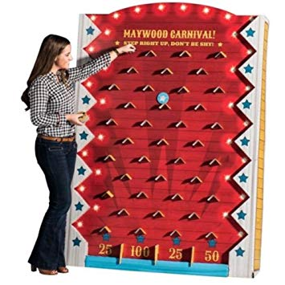
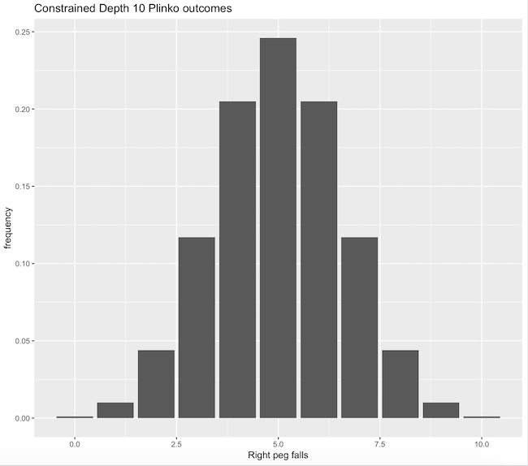

# The Uniform Plinko Problem
Generating asymptotically uniform distributions from Plinko boards.

## About Plinko
Plinko is a game of chance, featuring a board, ball, and buckets. The
board features a set of pegs positioned such that the ball may fall and
bounce between them, typically falling to the left or right of a given
peg with predetermined probabilities. Buckets are positioned at the
of the board in a way that the ball must fall into one of them. The
game is played by dropping the ball from the top of the board, and the
player wins whatever prize is associated with the bucket the ball falls
into.



Most variants of the game:
* allow the player to select a starting peg at the top of the board
* feature boards that are taller than wider - requiring walls on the
side of the board that the ball may bump into before falling to the next
peg

### In Action
A few notable examples of this game in action:
* [Plinketto](https://www.youtube.com/watch?v=rXYcFYaN_ns), a "worst of"
movie review show in which the movies reviewed are selected via
Plinko. This variant inspired my interest in the problem; no reviewer
wants the responsibility of picking which bad movie to watch (yet one
needs to be picked). Plinko, as will be discussed shortly, is not "fair"
conditioned on the starting peg. Therefore, the reviewers are somewhat
personally responsible for the movie watched. My goal is to entirely
remove this responsibility by making the sampling distribution uniform.
* [The Price is Right](https://www.youtube.com/watch?v=naUppHrHJpI), a
consumer game show. Their variant is  interesting because it's
non-trivial to manually compute expectations and thereby select the
optimal starting peg.

### Statistical Properties
To make analysis simpler, we'll constrain Plinko to only allow
the player can only drop the ball onto one peg, and furthermore, no
walls will be present.

In any Plinko board I have observed, the probability of going left at
any peg is approximately .5 (and .5 for right as well). This means
the pegs may be thought of IID Bernoulli trials, inducing a Binomial
distribution determining the final bucket landed in (by summing up the
number of left/right falls). Frustratingly, Plinko is often referenced
as a demonstration of the Central Limit Theorem (CLT). It is, but it's
disingenuous to make such a direct statement. The distribution is
binomial, which is asymptotically approximated by the Normal
distribution through the CLT (as a linear combination of IID Bernoulli
trials).

Here's the asymptotic break out of bucket outcomes for a constrained
depth 10 Plinko board under 50/50 splits:


And a more visual distribution:



## The Uniform Plinko Problem
Great! In the boring world, we have a binomial distribution. Can we
construct Plinko boards that produce other distributions? Specifically,
can we construct the uniform distribution for any depth Plinko board?

### Thoughts
Here are some thoughts relevant to this problem:
* Our only lever of control (for a fixed depth) is the probability
associated with left and right falls.
  * When probabilities are no longer 50/50, the Bernoulli trials at each
  level of the board are no longer independent.
  * Tweaking a probability high in the board has a substantial impact on
  outcomes at lower levels of the board
* The product of probabilities for falling left/right along the path
taken by the ball represents the total probability of that path
occurring.
  * i.e. Bernoulli trials along a path remain independent
* Same as before, unless a probability is exactly 0 or 1, a bucket k
has nCk possible paths (n = depth, k = number of left falls) from the
starting peg.
* I believe any solution to half the board should be able to be
reflected to produce a valid full solution.

### Approach
The approach taken was brute force and numerical:
* Traverse each starting peg -> bucket path in the Plinko board
* For each path, build an executable product of the probabilities along
the path
* For each bucket, build an executable summation of the path products

At this point, we have a system of equations! For example, a depth 2
board with 3 nodes has the following system (where x_i is the
probability of falling left for the ith node, labelled 1...3 top to
bottom, left to right):
```text
x_1 * x_2 = 1 / 3
x_1 * (1-x_2) + (1 - x_1) * x_3 = 1 / 3
(1 - x_1) * (1 - x_3) = 1 / 3
```
In general, this system will be highly underdetermined. For a depth n
board, there are n + 1 buckets, leading to n + 1 equations of n(n+1)/2
parameters. So, we prefer an optimization approach. Define a loss
function on the bucket outcomes B_i as: (1 / (n + 1) - B_i)^2, which is
simply squared loss on the uniform density. Depending on the numerical
optimization method used, other loss functions may be more ideal. With a
loss function in hand, all that is left is to apply a gradient based
optimizer. I had success with [BFGS](https://en.wikipedia.org/wiki/Broyden%E2%80%93Fletcher%E2%80%93Goldfarb%E2%80%93Shanno_algorithm),
constraining the state space to \[0,1\] (valid probabilities) for all
parameters.

## Solutions
Solutions are rendered with right fall probabilities only; left fall
probabilities are simply derived as the complement. To reproduce these
results and graphics see [uniform_plink.py](./uniform_plinko.py).

### Depth 3


### Depth 5


### Depth 10
Using the above python code, this solution took around 10 seconds to
compute.


